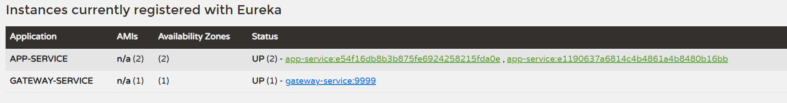

# Cloud Setup (Spring Cloud Microservices)

## Overview

This project demonstrates a simple Spring Cloud microservices setup with:

* **Config Server** – centralized configuration management
* **Eureka Server** – service discovery
* **Gateway Service** – API gateway (routing)
* **App Service** – example backend service

---

## Project Structure

```
root
├── config-server
├── eureka-server
├── app-service
├── gateway-service
└── cloud-config-properties
    ├── app-service/
    │   └── app-service.yml
    └── gateway-service/
        └── gateway-service.yml
```

---

## Configuration

### Local Configuration

Each service contains a minimal `application.yml` with:

* service name
* config server import
* basic server settings

Example (gateway-service):

```yaml
spring:
  application:
    name: gateway-service
  config:
    import: "optional:configserver:http://localhost:8888"

server:
  port: 9999
```

---

### Centralized Configuration

Most configurations are stored in the Config Server repository:

```
cloud-config-properties/
```

* `app-service/app-service.yml`
* `gateway-service/gateway-service.yml`

This pattern is reused for any new services:

```
{service-name}/{service-name}.yml
```

---

## Services

### Eureka Server

* Runs on `http://localhost:8761`
* Registers all services

---

### Config Server

* Runs on `http://localhost:8888`
* Serves centralized configuration files

---

### Gateway Service

* Entry point for all requests
* Uses Spring Cloud Gateway
* Routes requests to `app-service`

Example routes:

* `/app/**` → app-service
* `/second/**` → app-service

---

### App Service

* Registers with Eureka
* Uses dynamic port (`port: 0`)
* Example endpoints:

    * `/instance` → returns instance port
    * `/value` → returns value from config server

---

## Service Discovery

Both `gateway-service` and `app-service`:

* Register with Eureka
* Use service names for communication (`lb://APP-SERVICE`)

---

## Running the Project

Start services in this order:

1. **Config Server**
2. **Eureka Server**
3. **App Service**
4. **Gateway Service**

---

## Example Requests

Through Gateway:

```
GET http://localhost:9999/app/instance
GET http://localhost:9999/app/value
```

---

## Notes

* Configurations are dynamically loaded from the Config Server
* Multiple instances of `app-service` can be started for load balancing

* Gateway uses Eureka for service resolution
